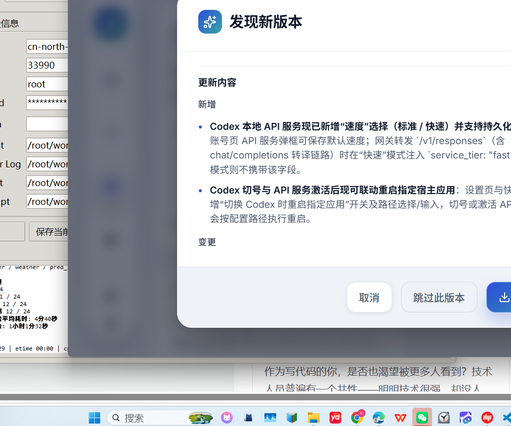
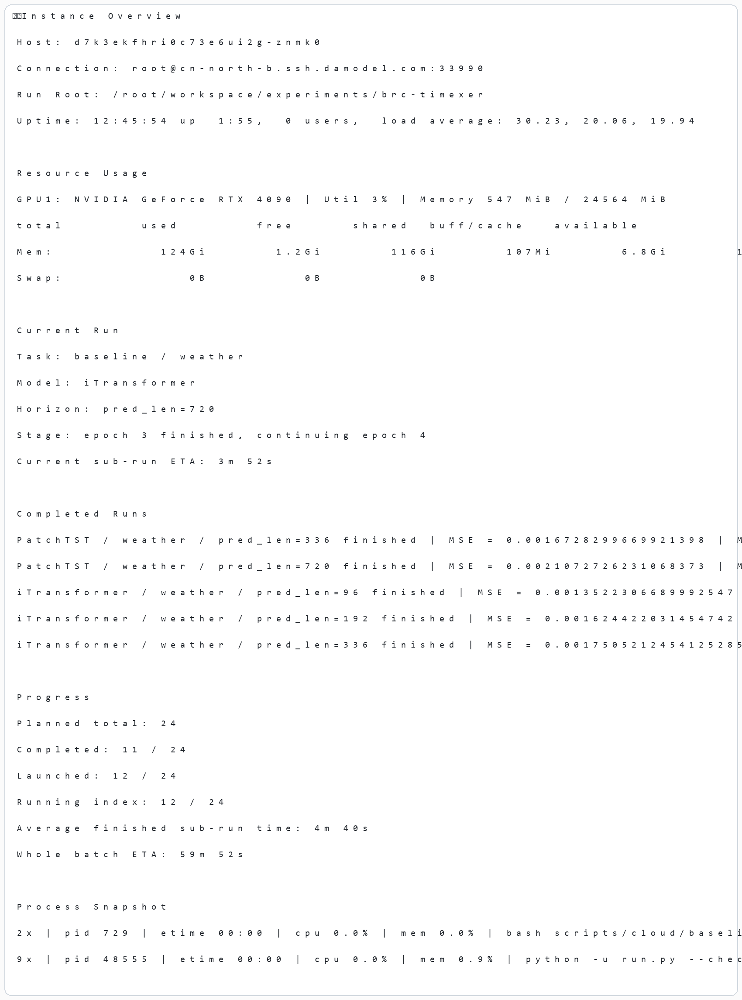

# 我把自己盯云端实验时最常用的小工具开源了：Cloud GPU Checker

最近一直在云端跑论文实验，最烦的一件事其实不是训练慢，而是你明明知道服务器还活着，却不知道它现在到底在干嘛。

很多时候我们第一反应都是上去敲一眼 `nvidia-smi`。  
这个命令当然有用，但它只能告诉你两件事：

- GPU 有没有在忙
- 显存占了多少

它并不能直接回答更关键的问题：

- 当前到底在跑哪个模型
- 当前跑到哪个 horizon
- 哪些子实验已经跑完了
- 结果目录里有没有指标出来
- 整批实验大概还要多久

所以我把自己这段时间一直在用的一个小工具整理出来，单独开源了，名字叫 `Cloud GPU Checker`。

## 先说两个最核心的亮点

这个工具对我来说，最重要的不是“能看 GPU 利用率”，而是下面两点：

- 能看当前状态
- 能估算剩余时间

也就是说，它不是只告诉你“GPU 还在转”，而是尽量回答：

- 当前到底在跑哪个模型
- 当前跑到第几个子实验
- 已经完成了多少
- 这一批实验还要不要继续等

## 截图

### GUI 界面

GUI 版支持保存多个实例配置，切换不同云服务器会方便很多。

### 状态结果

结果面板里会重点展示当前任务、当前模型、已完成部分，以及当前子实验和整批实验的大致剩余时间。

## 这个工具能做什么

它本质上是一个基于 SSH 的实验状态检查器。  
连接远程 Linux 服务器之后，它会把下面几类信息拼起来看：

- 远程进程状态
- launcher log
- 每个子实验的训练日志
- 结果目录中的 `metrics`
- 批量脚本对应的计划总数

最后输出的不是单纯的系统监控，而是更接近“实验语义”的状态信息，比如：

- 当前任务是什么
- 当前模型是什么
- 当前 `pred_len` 是多少
- 当前 epoch 跑到哪了
- 已经完成了多少个子实验
- 当前已经看到的 `MSE / MAE`
- 这一批实验的完成比例
- 当前子实验和整批实验的大致剩余时间

## 我为什么做它

原因很简单：我不想每次都在几种信息之间来回切。

以前盯实验时，我通常要同时看：

- `nvidia-smi`
- `ps`
- `tail -f`
- 实验结果目录
- 自己写的批量脚本

这样看不是不能看，只是很散，而且很容易漏信息。  
后来我就把这些步骤合到一起，做成了这个工具。自己用了几轮之后，确实省事很多，所以顺手整理成了公开版本。

## 适合什么场景

- 云端训练时间序列、CV、NLP 等模型
- 多模型 baseline / ablation 串行实验
- 想判断“是真在训练，还是只是显存挂着”
- 一台机器上保存多个 SSH 实例配置，来回切换查看

## 目前支持

- CLI 版本
- Windows GUI 版本
- 多实例配置保存与切换
- 读取 SSH 密码或私钥

## 开源地址

GitHub：

<https://github.com/z117122/cloud-gpu-checker>

如果你也经常在云端跑实验，应该会比单看 `nvidia-smi` 更顺手一点。  
如果后面我继续补功能，优先会加：

- 自动刷新
- 卡住检测
- 更清晰的表格化状态展示

欢迎直接拿去改，或者接进你自己的实验工作流。
